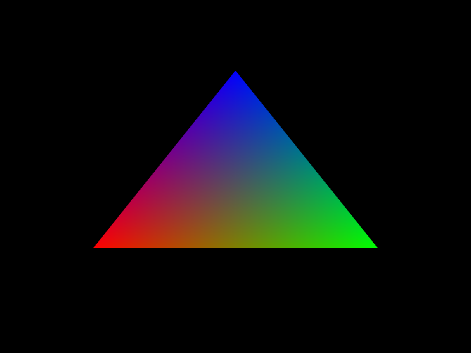

# Triangle example



This example opens a window and draws a colored triangle using OpenGL 3.3.
From this folder, run it with:
```
dub run
```

From the root of the repository, run it with:
```
dub run glfw-d:empty-window
```
