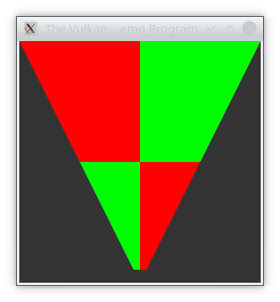

# Vulkan triangle example



This example opens a window and draws a triangle using Vulkan.

It is a translation of [triangle-vulkan.c](https://github.com/glfw/glfw/blob/33cd8b865d9289cfbcf3d95e6e68e4050b94fcd3/tests/triangle-vulkan.c) from the GLFW test suite.
Instead of [glad](https://github.com/glfw/glfw/blob/33cd8b865d9289cfbcf3d95e6e68e4050b94fcd3/deps/glad_vulkan.c) and glfw's vulkan module, it uses [erupteD](https://github.com/ParticlePeter/ErupteD) as the Vulkan function loader.

From this folder, run it with:
```
dub run
```

From the root of the repository, run it with:
```
dub run glfw-d:triangle-vulkan
```
